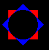
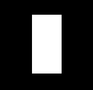
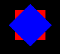

# Cubetto



Cubetto viene disegnato con due quadrati (uno rosso e uno blu) e un cerchio nero al centro per fare il buco.

## Un quadrato bianco

Partiamo con fare un quadrato bianco... quindi aggiungiamo cubetto a animator.

Aggiungiamo il componente `Cubetto` a `Animator` nel fle `animator.kv`

```
#:kivy 1.0.9

<Cubetto>:
    

<Animator>:
    Cubetto:
        center: root.width*0.5, root.height * 0.5
        size_hint: None,None
        width: dp(50)
```

Abbiamo detto di aggiungere a `<Animator>` un nuovo oggetto cubetto al centro (metà larghezza e metà altezza) largo 50 
*punti*. 

Eseguiamo e...

```
   File "/usr/local/lib/python2.7/dist-packages/kivy/factory.py", line 131, in __getattr__
     raise FactoryException('Unknown class <%s>' % name)
 kivy.factory.FactoryException: Unknown class <Cubetto>
```

... Manca Cubetto in `main.py`. Aggiungiamo quindi come un semplice `Widget` in `main.py`

```python
from kivy.uix.widget import Widget


class Cubetto(Widget):
    pass
```

Riproviamo... ora funziona me è ancora tutto nero: giusto ... ci siamo dimenticati di disegnare il quadrato. Dentro
`animator.kv` modifichiamo `<Cubetto>` come

```
<Cubetto>:
    canvas:
        Rectangle:
            pos: self.pos
            size: self.size
```

Proviamo e ... 



Non è proprio quello che volevamo.... l'altezza deve essere uguale alla larghezza! Diciamolo aggiungendo la riga
`height: self.width` a `<Cubetto>`.

```
<Cubetto>:
    height: self.width
    canvas:
        Rectangle:
            pos: self.pos
            size: self.size
```

Ecco il nostro quadrato bianco.

## Il quadrato diventa Rosso

Per far diventare il quadrato rosso bisogna dire semplicemente di usare il colore rosso prima di disegnare il quadrato.

Per indicare il colore rosso basta usare `rgb: (1,0,0)` e quindi modificare `<Cubetto>` prima di disegnare il rettangolo
 

```
    Color:
        .... 
```

Esistono però tanti modi per indicare un colore. Noi useremo 

```
    rgb: (rosso,verde,blu)
```

Dove `rosso`, `verde` e `blu` sono tre valori tra 0 e 1 che indicano quanto di quel colore usare. Quindi il rosso 
diventa `rgb: (1,0,0)`

```
<Cubetto>:
    height: self.width
    canvas:
        Color:
            rgb: (1,0,0)
        Rectangle:
            ....
```

Proviamo e ... **ecco il quadrato rosso**.

Prima di andare avanti costruiamoci un po di colori da usare invece dei numeri: all'inizio di `animator.kv`
aggiungiamo i nostri colori e sostuiamo `(1,0,0)` con rosso.

```
#:kivy 1.0.9

#:set nero (0, 0, 0)
#:set bianco (1, 1, 1)
#:set rosso (1, 0, 0)
#:set verde (0, 1, 0)
#:set blu (0, 0, 1)


<Cubetto>:
    height: self.width
    canvas:
        Color:
            rgb: rosso
        Rectangle:
            ....
```

## Il quadrato blu

Ora dobbiamo fare un quadrato blu.... ma girato di 45 gradi. Per girare bisogna indicare di fare una rotazione del 
*foglio* prima di disegnare il prossimo rettangolo. Quindi:

1. Ruotare il foglio
2. Colore
3. Rettangolo

Il 2 e il 3 li sappiamo già fare, ma per ruotare?

Con
```
        Rotate:
            angle: 45
            origin: self.center
```

dentro alla **tela** (`canvas`) si dice di ruorare la **tela** di 45 gradi tenendo il centro fisso prima di fare i
prossimi disegni.

Quindi dopo aver disegnato il rettangolo rosso aggiungiamo:

```
<Cubetto>:
    height: self.width
    canvas:
        .... Il rettangolo rosso
        Rotate:
            angle: 45
            origin: self.center
        Color:
            rgb: blu
        Rectangle:
            pos: self.pos
            size: self.size
```

Ecco cosa viene fuori:




## Il cerchio nero al centro

Per fare l'effetto *buco* basta fare un cerchio dentro ai quadrati. I cerchi pieni si costruiscono usando la parola
`Ellipse` che deve avere la stassa posizione e dimensione dei `Rectangle`... ricordatevi di usare il colore `nero`.

Quindi dopo i rettangoli aggiungiamo:

```
<Cubetto>:
    ...
    canvas:
        Color:
            rgb: nero
        Ellipse:
            pos: self.pos
            size: self.size
```

**BELLO!**


* [**NEXT** Muoviamo Cubetto](muovi.md)
* [**PREV** Indice](start.md)
* [**INDEX** Indice](start.md)
